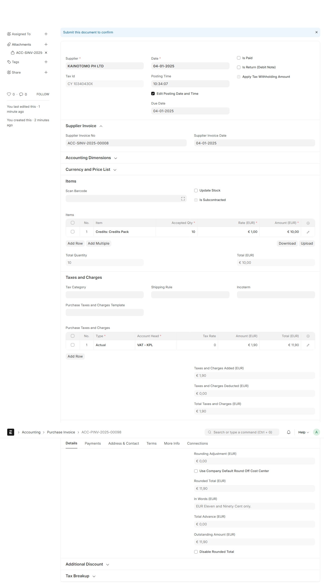

# Invoice2Erpnext User Guide

A seamless integration for automatically processing scanned invoices and creating Purchase Invoices in ERPNext.

## Overview

Invoice2Erpnext is an advanced tool that automatically processes invoices from various formats (PDF, images, etc.) and creates Purchase Invoices in ERPNext. The system extracts data from invoice documents, intelligently reconciles financial information, and creates all necessary related documents.

## Prerequisites

Before using Invoice2Erpnext, ensure:

1. You've installed the Invoice2Erpnext app in your ERPNext instance. Currently compatible with **ERPNext version 15**.
2. Your administrator has configured the "Invoice2Erpnext Settings" with:
   - API credentials (api_key and api_secret) obtained from [https://kainotomo.com/api_keys](https://kainotomo.com/api_keys)
   - Default VAT account for tax calculations
   - Default Supplier Group for new suppliers
   - Default Item Group for extracted items
   - One Item Invoice option (if you prefer all line items to be consolidated)
   - Default Item (required when One Item Invoice is enabled)
3. Make sure you have sufficient credits for processing invoices, available from [https://kainotomo.com/invoice2erpnext/shop](https://kainotomo.com/invoice2erpnext/shop)

### Installation

To install Invoice2Erpnext:

1. Navigate to your bench directory:
   ```
   cd /path/to/frappe-bench
   ```

2. Get the app:
   ```
   bench get-app invoice2erpnext https://github.com/kainotomo/invoice2erpnext
   ```

3. Install the app on your site:
   ```
   bench --site your-site.com install-app invoice2erpnext
   ```

4. Run migrations to update the database:
   ```
   bench --site your-site.com migrate
   ```

### Configuration

To configure Invoice2Erpnext:

1. Log in to your ERPNext site with Administrator privileges
2. Navigate to **Invoice2Erpnext Settings** in the menu
3. Configure the following required settings:
   - **API Credentials**: Enter your api_key and api_secret obtained from [https://kainotomo.com/api_keys](https://kainotomo.com/api_keys)
   - **Default VAT Account**: Select the account to be used for tax calculations
   - **Supplier Group**: Choose the group where new suppliers will be categorized
   - **Item Group**: Select the default group for new items created from invoices
   - **One Item Invoice**: Enable this option if you want all invoice items to be consolidated into a single line item
   - **Item**: If One Item Invoice is enabled, select the default item to use for all invoices

4. Save the settings

These configurations are essential for the app to function properly. Without valid API credentials and proper account settings, the system won't be able to process invoices correctly.

## How to Use

### Processing Invoices

To process invoices with Invoice2Erpnext:

1. Navigate to the **Purchase Invoice** list view

2. Click the dropdown menu and select one of the following upload options:
   - **Upload (Auto)**: Fully automatic processing where the system will identify the supplier, items, and all financial data without user input. Best for clear, well-structured invoices from established suppliers.
   - **Upload (Manual)**: Requires you to select a specific supplier and item while the system extracts only the financial data. Ideal for unusual invoices, low-quality scans, or when you want consistent item categorization.
3. Select the invoice files you want to process

4. The system will:
   - Process each file automatically
   - Create Purchase Invoices in draft status
   - Generate Logs with the result

Once processed, you can review and submit the created Purchase Invoices after verifying their accuracy.



## Understanding the Process

The system performs these steps automatically:

1. **Document Extraction**: Sends the invoice to KAINOTOMO server that extracts text and structures data fields
2. **Data Validation**: Checks for consistency in extracted financial data using confidence scores
3. **Intelligent Reconciliation**: If discrepancies exist in totals, subtotals, or taxes, the system determines which values are most reliable based on confidence scores and adjusts values accordingly
4. **Document Creation**:
   - Creates Supplier if not already in system
   - Creates Items if not already in system (or uses a single default item if configured)
   - Creates Purchase Invoice with line items, taxes, and totals
   - Handles special cases like credit notes and decimal point inconsistencies
5. **File Attachment**: Links the original invoice file to the created Purchase Invoice

### Processing Modes

The system offers two processing modes:

1. **Automatic Mode** (Default): The system extracts all information automatically and creates corresponding documents with no user intervention. Best for high-quality invoices from established suppliers.

2. **Manual Mode**: Allows you to select a specific supplier and item while the system extracts only the financial data. Useful when:
   - Working with unfamiliar suppliers
   - Dealing with low-quality scans
   - Needing consistent item categorization for reporting

## Monitoring Results

After processing, use the Invoice2Erpnext Log to monitor status:

1. Navigate to **Invoice2Erpnext Log** in your ERPNext menu
2. View processing status for each uploaded file:
   - Status: Shows "Success" if completed successfully, or "Error" if issues occurred
   - Created Docs: Lists all documents created from the invoice
   - Message: Contains detailed processing information or error messages
   - Cost: Shows the processing cost deducted from your credit balance

The original file will be automatically attached to the new Purchase Invoice.

## Troubleshooting

If processing fails:
- Check the Invoice2Erpnext Log status and message fields for specific error details
- Common issues include:
  - Poor quality scans of invoices
  - Missing critical data (vendor name, invoice date, etc.)
  - Inconsistent totals that can't be reconciled
  - Connection issues with KAINOTOMO extraction service
  - Decimal point inconsistencies in amount fields
  - Insufficient credits in your account

For best results:
- Ensure your invoice files are clear, properly scanned, and contain all critical information
- Verify that suppliers and default items are properly configured
- Check your credit balance regularly at [https://kainotomo.com/invoice2erpnext/shop](https://kainotomo.com/invoice2erpnext/shop)